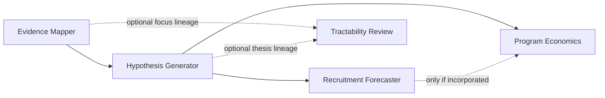

# Output orchestrator integration

Highlander is a snapshot consumer, not a pipeline orchestrator. The output
orchestrator runs the producer modules, stores their exact artifacts, selects
one terminal attempt per module and hypothesis, creates immutable packet
revisions, and then calls Highlander.

## Request shape

```json
{
  "schemaVersion": "highlander.packet-comparison-request.v1",
  "snapshotId": "highlander-job-001",
  "createdAt": "2026-08-16T12:00:00Z",
  "objectivePolicy": {
    "policyId": "program-frontier.v1",
    "objectives": [
      {"objectiveId": "support", "direction": "MAX"},
      {"objectiveId": "contradiction_risk", "direction": "MIN"},
      {"objectiveId": "recruitability", "direction": "MAX"},
      {"objectiveId": "roi", "direction": "MAX"}
    ]
  },
  "candidatePackets": [
    {
      "packetRevisionId": "packet-H-g2-r1",
      "packetHash": "<RFC8785-JCS-SHA256>",
      "runId": "run-001",
      "hypothesisId": "H-g2",
      "modulePackets": ["<module envelope>", "..."],
      "exclusionReasons": []
    }
  ],
  "artifactPayloads": {
    "artifact://run-001/H-g2/hypgen/input": "<base64 exact bytes>",
    "artifact://run-001/H-g2/hypgen/output": "<base64 exact bytes>"
  }
}
```

All candidates in one v1 request must share the same `runId`. Highlander does
not perform cross-run comparison under this schema.

`artifactPayloads` is for a self-contained CLI request. A service should
usually resolve artifacts from its content-addressed store instead:

```python
result = compare_packet_request(request, artifact_resolver=cas.read_bytes)
```

The resolver must return exact `bytes` for every referenced input, output, or
execution artifact. References are deliberately opaque and may only use
`artifact://` or `cas://`; do not put a presigned URL, query string, user info,
token, or storage credential in a request.

## Module envelope

```json
{
  "runId": "run-001",
  "hypothesisId": "H-g2",
  "moduleId": "trial-recruitment-forecaster",
  "attemptId": "recruitment-H-g2-attempt-1",
  "nativeSchemaId": "https://github.com/REagent-LABrador/clinical_simulation/schemas/output.schema.json",
  "nativeSchemaVersion": "1.0.0",
  "producerCodeVersion": "13783c962d303a04ff63c7dbb59e49b4369038c1",
  "adapterVersion": "packet-adapters.v1",
  "executionStatus": "SUCCEEDED",
  "executionReason": null,
  "evidenceBasis": "MODELED",
  "inputRawSha256": "<64 lowercase hex>",
  "outputRawSha256": "<64 lowercase hex>",
  "outputCanonicalSha256": "<RFC8785-JCS-SHA256 of payload>",
  "envelopeCanonicalSha256": "<RFC8785-JCS-SHA256 of this envelope without this field>",
  "inputArtifactRef": "artifact://run-001/H-g2/recruitment/input",
  "outputArtifactRef": "artifact://run-001/H-g2/recruitment/output",
  "executionArtifactRef": null,
  "executionArtifactRawSha256": null,
  "dependsOn": [
    {
      "moduleId": "hypothesis-generator",
      "outputCanonicalSha256": "<selected headless HypGen response hash>",
      "envelopeCanonicalSha256": "<selected candidate-specific headless-response envelope hash>"
    }
  ],
  "subject": {
    "graphId": "g_1a4f",
    "graphRound": 2,
    "thingId": "T1",
    "targetSymbol": "IRAK4",
    "uniprotAccession": "Q9NWZ3",
    "mechanismHypothesis": "orthosteric",
    "asOf": "2026-08-15",
    "modality": "small_molecule"
  },
  "qualifiers": ["MODELED", "SIMULATED"],
  "payload": {"score": 0.27}
}
```

The example payload is abbreviated; the adapter requires the complete locked
native output. `outputRawSha256` covers the exact resolved JSON bytes, while
`outputCanonicalSha256` covers the parsed `payload` using RFC 8785 JCS. Producer
schemas stay untouched: this envelope is a consumer-owned orchestration
contract, not a change to any locked module input or output.

Every module envelope includes all fields shown above. For a successful attempt,
the four output fields (`outputRawSha256`, `outputCanonicalSha256`,
`outputArtifactRef`, and `payload`) are all present. For an allowed output-less
terminal attempt they are all `null`; `executionArtifactRef` and
`executionArtifactRawSha256` must then identify exact logs, receipts, or other
terminal evidence. An execution artifact may also accompany a native output.

Supported terminal statuses are `SUCCEEDED`, `COMPLETED`, `COMPLETE`, `FAILED`,
`CANCELLED`, `SKIPPED`, `PARTIAL`, `NOT_AMENABLE`, `NEEDS_INPUT`,
`BLOCKED`, and `UNKNOWN_OUTCOME`. Unsuccessful terminal states require
`executionReason`. `PARTIAL` still requires a native output; the other
unsuccessful statuses may be output-less when terminal evidence is supplied.
`QUEUED` and `RUNNING` envelopes are rejected because Highlander snapshots
cannot include mutable work.

`NOT_WIRED` is not an execution status. Represent unwired work as
`executionStatus: "SKIPPED"`, `executionReason: "MODULE_NOT_WIRED"`, and a
structured evidence basis such as `NOT_WIRED`; these state axes stay separate.

Output-less attempts are adapted into the result's module-attempt ledger. They
do not invent an empty native payload or a score. Whether the candidate remains
comparable is decided by the selected objective policy and dependency lineage.

## Input binding

The bytes referenced by `inputArtifactRef` are not just the producer's native
input. They are a JSON wrapper that binds the exact attempt and selected parent
lineage while leaving `nativeInput` unchanged:

```json
{
  "schemaVersion": "labrador.module-input-binding.v1",
  "runId": "run-001",
  "hypothesisId": "H-g2",
  "moduleId": "trial-recruitment-forecaster",
  "attemptId": "recruitment-H-g2-attempt-1",
  "dependsOn": [
    {
      "moduleId": "hypothesis-generator",
      "outputCanonicalSha256": "<selected headless HypGen response hash>",
      "envelopeCanonicalSha256": "<selected candidate-specific headless-response envelope hash>"
    }
  ],
  "inputIdentity": {
    "hypothesisId": "H-g2",
    "thesisId": "H-g2"
  },
  "nativeInput": {"id": "H-g2", "<rest of canonical snake_case IndicationThesis>": "<unchanged>"}
}
```

`inputRawSha256` covers these exact bytes. Highlander parses the wrapper with
duplicate-key rejection and checks its identity and `dependsOn` values against
the module envelope. This prevents a downstream artifact from being relabeled
onto another candidate or selected branch without changing the digest.

`nativeInput` remains the producer's unchanged invocation input. Correlation
claims that are not fields in a locked producer input belong in the separate
consumer-owned `inputIdentity` object:

- every attempt repeats `hypothesisId`;
- recruitment adds `thesisId`, which must match the native thesis `id`;
- economics adds `programId`; it adds `recruitmentOutputCanonicalSha256` only
  when the native invocation actually incorporated that recruitment output;
- tractability adds `uniprotAccession`, which must match both the native input
  and the envelope subject.

Highlander validates these fields against the selected dependencies and native
output snapshot. This adds orchestration identity without changing any locked
producer schema.

## Dependency rules

The selected terminal packet is a typed DAG:



- If mapper and hypothesis generator are both selected, the generator must
  reference the exact mapper output.
- Recruitment requires the exact selected hypothesis-generator output.
- Tractability can run independently from a branch accession even when HypGen
  fails. It may optionally bind the mapper and/or HypGen output if either was
  actually used; an undeclared parent is never inferred.
- Economics requires the exact selected hypothesis-generator output because its
  native request is HypGen's complete ROI request. Recruitment is an optional
  parent and must be declared only if its output was actually incorporated.
- Every dependency reference names the parent module, its canonical output
  hash, and its candidate-specific canonical envelope hash. Binding both is
  necessary because two candidates can legitimately contain byte-identical
  native output.
- `outputCanonicalSha256` is `null` when the selected parent is an honest
  output-less terminal attempt. The parent envelope hash remains mandatory and
  binds that exact failed, blocked, or skipped record.
- A successful child cannot normally depend on a non-successful, malformed,
  schema-mismatched, or quarantined parent. One narrow exception allows
  clinical to bind a `PARTIAL` HypGen attempt that still carries a canonical
  hypothesis/thesis output but could not emit its separate complete ROI request.
  The partial HypGen attempt remains visible and supplies no HypGen objectives.

The consumer also checks mapper and the nested HypothesisDocument
`graph_id`/round consistency, terminal
run/hypothesis identity, one selected attempt per module, the module-envelope
digest, the input-binding wrapper, and exact raw artifact hashes.

## Module envelope hash

`envelopeCanonicalSha256` is the lowercase SHA-256 of the RFC 8785 JCS encoding
of that module envelope with only `envelopeCanonicalSha256` omitted. It binds
run, hypothesis, attempt, schema and adapter pins, status, artifact hashes,
dependencies, subject, qualifiers, and the native payload. The orchestrator
must supply it; Highlander recomputes it before using the envelope.

## Terminal packet hash

Before hashing, the orchestrator must:

1. deduplicate exact repeated module envelopes;
2. sort module envelopes by `moduleId`;
3. deduplicate and sort `exclusionReasons`;
4. construct the body below.

```json
{
  "packetRevisionId": "packet-H-g2-r1",
  "runId": "run-001",
  "hypothesisId": "H-g2",
  "modulePackets": ["<sorted unique envelopes>"],
  "exclusionReasons": []
}
```

Serialize that body with RFC 8785 JCS and take lowercase SHA-256. The consumer
accepts the digest with or without a `sha256:` prefix. Changing the revision,
identity, attempt, dependency, subject, artifact hash, qualifier, native
payload, or exclusion reason invalidates the terminal hash.

## Trust and threat boundary

These hashes detect accidental corruption, mutation, and lineage mismatch only
after Highlander trusts the party selecting the snapshot. They provide
integrity, not authenticity: an untrusted caller can construct different JSON
and recompute every digest. At an external or otherwise untrusted boundary,
the service must authenticate the caller and either verify a signature over the
terminal packet or compare `packetHash` with an orchestrator/DB-attested value
retrieved out of band. Artifact-store authorization belongs in the resolver,
not in packet references or request JSON.

Highlander also assumes the trusted output orchestrator owns terminal-attempt
selection, packet revision IDs, timestamps, and native producer execution. It
does not call or modify the five upstream modules.

## Resource limits

The v1 consumer accepts at most 500 candidates, 10 envelope entries per
candidate, 32 objective rules, and 5,000 embedded artifacts. Resolved artifacts
are limited to 16 MiB each and 128 MiB total; embedded values are decoded only
when referenced. The CLI caps raw request JSON at 192 MiB and rejects duplicate
keys, non-I-JSON numbers, or nesting beyond 64 levels. A network service should
apply its own transport, authentication, rate, and concurrency limits before
calling the library. The demo orchestrator owns a four-minute wall-clock limit
for the `python -m highlander compare` process.

## Native outputs and objectives

- Evidence Mapper remains run/graph context and emits no candidate score.
  `no_effect` stays neutral and distinct.
- Hypothesis Generator emits native `support`, `novelty`, `testability`, and
  `contradiction_risk` observations. Display-only `rank_score` is ignored.
- Recruitment emits native `score` and preserves enrollment uncertainty and
  evidence.
- Economics emits raw P50 rNPV and preserves P10/P90, currency, valuation year,
  engine, assumptions, warnings, and decision grade.
- Tractability emits a categorical posture only. Any future scalar policy must
  be separately versioned; Highlander does not threshold native axes.

Missing or malformed values emit no objective. Rejected, unverified, and
blocked candidates are excluded by default. `NOT_DECISION_GRADE` excludes the
specific objective when that objective is selected. Other failed or partial
attempts remain visible without a fabricated value; a required missing axis or
an unusable dependency makes the affected candidate incomparable. The output
policy records these eligibility rules.

## Producer-grounded next action

The result keeps no-winner Pareto semantics and adds one advisory
`nextEvidenceAction`. It is `null` when no current producer emitted a usable
ask, gap, or follow-up. Otherwise it contains the producer module and output
hash, exact source path, action type, target, description, candidate IDs, and a
stable action ID. The selector prefers the same producer-emitted action across
the most branches, then uses a deterministic source-order tie break. It never
uses Highlander scores to invent an experiment and never changes frontier,
dominated, or incomparable membership.

## Legacy demo

`python -m highlander run` and `python -m highlander.demo` use mock/proxy tier
bodies. They are retained for archive/search demonstrations only and must not
be wired into the output orchestrator.
